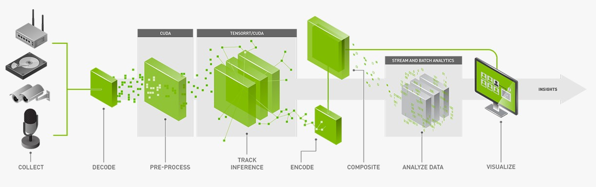
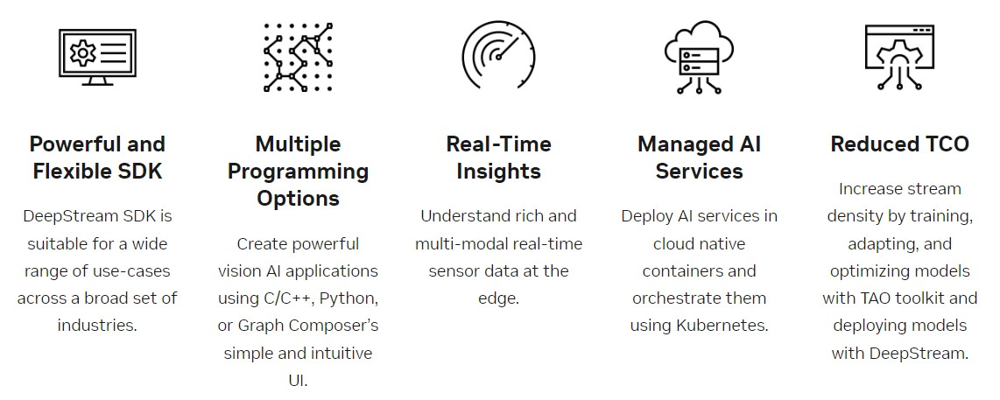
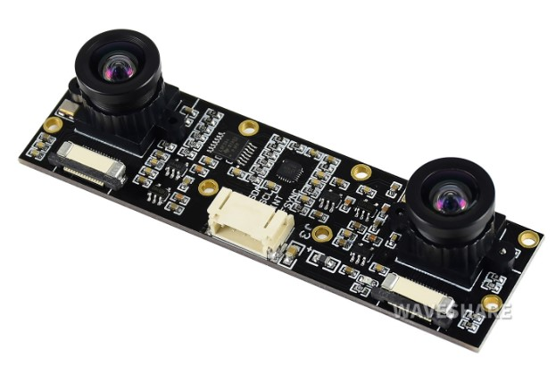

# **Grape Detection using YOLO and DeepStream SDK**



This implementation is used for detecting grape (an auxiliary part for [grape_harvesting_robot](https://github.com/huynhloc04/LVTN/tree/main/Vision_WS)) using YOLOv5s and deploying trained models with DeepStream SDK - and end-to-end solution for video analytics

## ***DeepStream key benefits***



***Note:*** *To see more about DeepStream SDK, visit: https://developer.nvidia.com/deepstream-sdk*

## **DeepStream usage**

### **Input**

In this project, we use camera stereo IMX219-83 to get input images.

<p align="center">
  
</p>

***Note:*** *If you use your own camera (USB camera, RTSP,...), change the following line of code of the deepstream_app_config.txt config file.*

```bash
[source0]
enable=1
#Type - 1=CameraV4L2 2=URI 3=MultiURI 4=RTSP 5=CSI
type=5

and

[source1]
enable=1
#Type - 1=CameraV4L2 2=URI 3=MultiURI 4=RTSP 5=CSI
type=5
```

 => Change type=5 of CSI camera to 1, 2, 3,... to proper with your input devices


### **Models**

To use your own model, change the followings of the config_infer_primary_yoloV5.txt config file

**1. Change to engine file**
```bash
model-engine-file=model_b1_gpu0_fp16.engine
```

**2. Change to plugin file**
```bash
custom-lib-path=nvdsinfer_custom_impl_Yolo/libnvdsinfer_custom_impl_Yolo.so
```


### **Outputs**

After inference, it is indispensable to visualize the output. You can change how to visualize the output by re-config in **[osd]** tag of config_infer_primary_yoloV5.txt file

```bash
[osd]
enable=1
gpu-id=0
border-width=3                                                              
text-size=13
text-color=1;1;1;1;
text-bg-color=0.3;0.3;0.3;1
font=Serif
show-clock=0
clock-x-offset=800
clock-y-offset=820
clock-text-size=12
clock-color=1;0;0;0
nvbuf-memory-type=0
```

To learn more about *"DeepStream Reference Application"*, visit: [deepstream-reference-application](https://docs.nvidia.com/metropolis/deepstream/dev-guide/text/DS_ref_app_deepstream.html)


